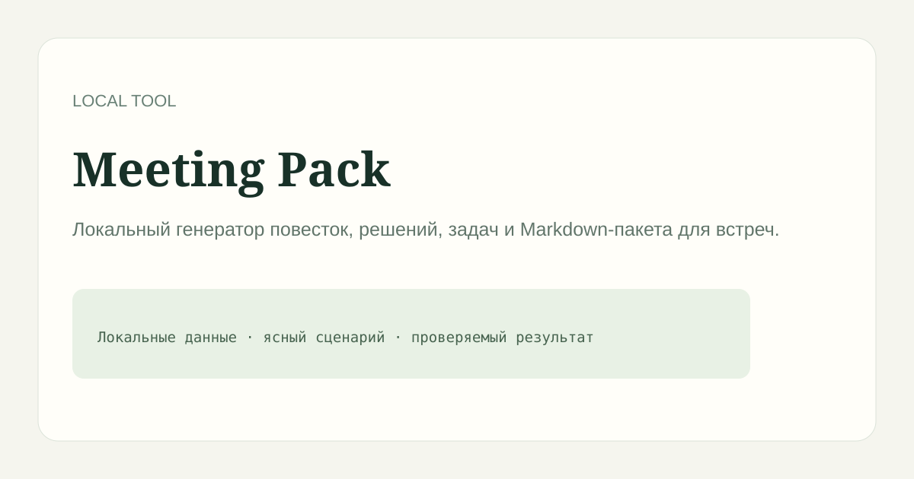

# Meeting Pack

> Локальный генератор повесток, решений, задач и Markdown-пакета для встреч.

## Возможности

Проект запускается локально, хранит записи в JSON-файле вне Git и не передаёт пользовательские данные наружу.

## Запуск

~~~bash
npm ci
npm start
~~~

Откройте http://localhost:3000.

## Проверка

~~~bash
npm test
npm run check
~~~

## Ограничения

Это самостоятельный MVP для локальной работы. Он не заменяет серверную систему совместной работы, облачную LMS или внешний сканер сети.

## Лицензия

MIT.
